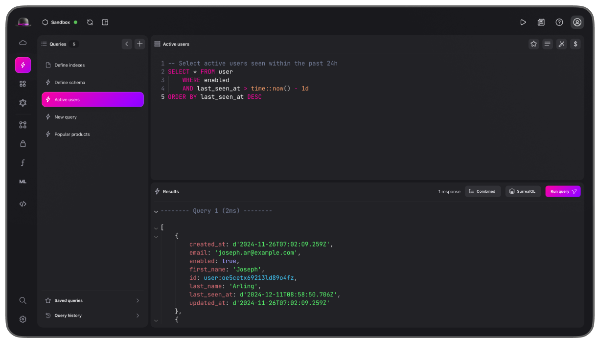
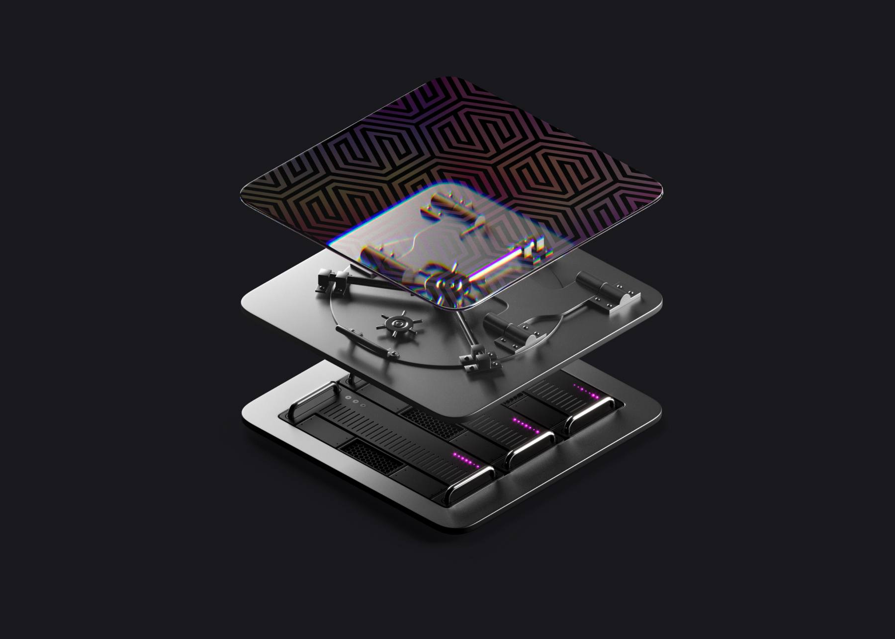
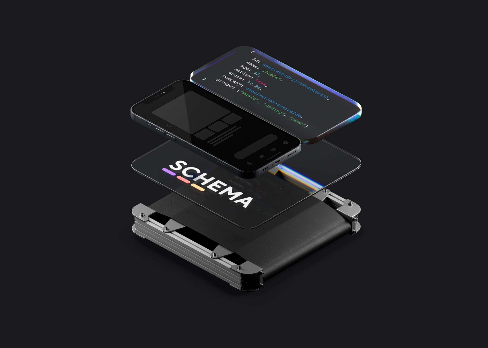
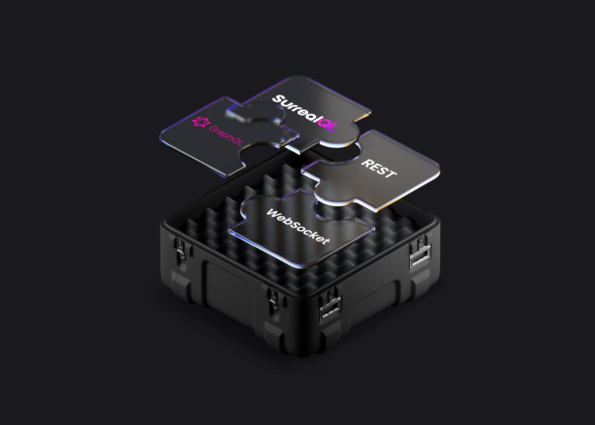
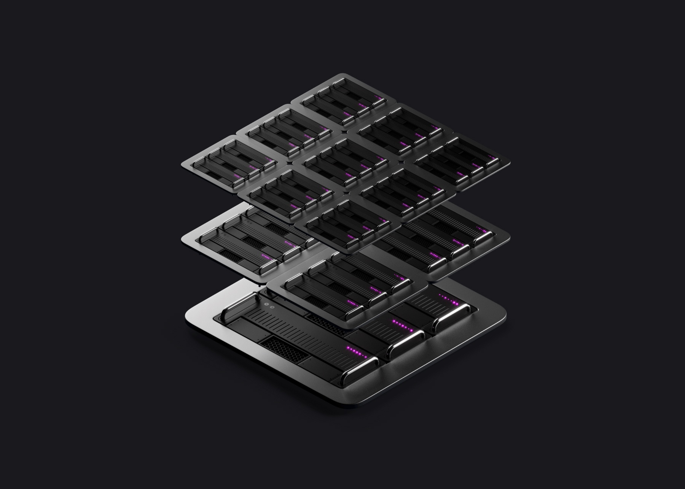
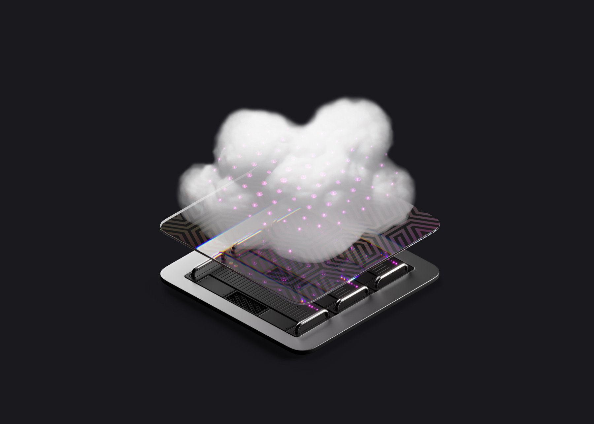

<a href="https://surrealdb.com#gh-dark-mode-only" target="_blank">
    
</a>
<a href="https://surrealdb.com#gh-light-mode-only" target="_blank">
    
</a>

<p align="center">
    <a href="https://github.com/surrealdb/surrealdb"></a>
    &nbsp;
    <a href="https://github.com/surrealdb/surrealdb"></a>
    &nbsp;
	<a href="https://github.com/surrealdb/surrealdb/actions"></a>
    &nbsp;
    <a href="https://github.com/surrealdb/license"></a>
</p>

<p align="center">
    <a href="https://hub.docker.com/repository/docker/surrealdb/surrealdb"></a>
    &nbsp;
    <a href="https://crates.io/crates/surrealdb"></a>
	&nbsp;
    <a href="https://www.npmjs.com/package/surrealdb.js"></a>
    &nbsp;
	<a href="https://pypi.org/project/surrealdb/"></a>
	&nbsp;
	<a href="https://www.nuget.org/packages/SurrealDb.Net"></a>
	&nbsp;
	<a href="https://packagist.org/packages/surrealdb/surrealdb.php"></a>
    &nbsp;
	<a href="https://hub.docker.com/repository/docker/surrealdb/surrealdb"></a>
</p>

<p align="center">
	<a href="https://surrealdb.com/discord"></a>
	&nbsp;
    <a href="https://x.com/surrealdb"></a>
    &nbsp;
    <a href="https://dev.to/surrealdb"></a>
    &nbsp;
    <a href="https://www.linkedin.com/company/surrealdb/"></a>
	&nbsp;
    <a href="https://www.youtube.com/@surrealdb"></a>
</p>

<p align="center">
	<a href="https://surrealdb.com/blog"></a>
	&nbsp;
	<a href="https://github.com/surrealdb/surrealdb"></a>
	&nbsp;
    <a href="https://www.linkedin.com/company/surrealdb/"></a>
    &nbsp;
    <a href="https://x.com/surrealdb"></a>
    &nbsp;
    <a href="https://www.youtube.com/@surrealdb"></a>
    &nbsp;
    <a href="https://dev.to/surrealdb"></a>
    &nbsp;
    <a href="https://surrealdb.com/discord"></a>
    &nbsp;
    <a href="https://stackoverflow.com/questions/tagged/surrealdb"></a>
</p>

<br>

<h2>&nbsp;&nbsp;What is SurrealDB?</h2>

SurrealDB is an end-to-end cloud-native database designed for modern applications, including web, mobile, serverless, Jamstack, backend, and traditional applications. With SurrealDB, you can simplify your database and API infrastructure, reduce development time, and build secure, performant apps quickly and cost-effectively.

**Key features of SurrealDB include:**

- **Reduces development time**: SurrealDB simplifies your database and API stack by removing the need for most server-side components, allowing you to build secure, performant apps faster and cheaper.
- **Real-time collaborative API backend service:** SurrealDB functions as both a database and an API backend service, enabling real-time collaboration.
- **Support for multiple querying languages:** SurrealDB supports SQL querying from client devices, GraphQL, ACID transactions, WebSocket connections, structured and unstructured data, graph querying, full-text indexing, and geospatial querying.
- **Granular access control**: SurrealDB provides row-level permissions-based access control, giving you the ability to manage data access with precision.

View the [features](https://surrealdb.com/features), the latest [releases](https://surrealdb.com/releases), and [documentation](https://surrealdb.com/docs).



<h2>&nbsp;&nbsp;Contents</h2>

- [Features](#features)
- [Documentation](#documentation)
- [Getting started](#getting-started)
	- [Server side code](#server-side-code)
	- [Client side apps](#client-side-apps)
- [Surreal Cloud](#surreal-cloud)
- [Installation](#installation)
	- [Install on macOS](#install-on-macos)
	- [Install on Linux](#install-on-linux)
	- [Install on Windows](#install-on-windows)
	- [Run using Docker](#run-using-docker)
- [Quick look](#quick-look)
- [Why SurrealDB](#why-surrealdb)
	- [Database, API, and permissions](#database-api-and-permissions)
	- [Tables, documents, and graph](#tables-documents-and-graph)
	- [Advanced inter-document relations](#advanced-inter-document-relations-and-analysis-no-joins-no-pain)
	- [Simple schema definition](#simple-schema-definition-for-frontend-and-backend-development)
	- [Connect directly from web-browsers](#connect-and-query-directly-from-web-browsers-and-client-devices)
	- [Multiple different query methods](#query-the-database-with-the-tools-you-want)
	- [Realtime live queries and data changes](#realtime-live-queries-and-data-changes-direct-to-application)
	- [Scale effortlessly for high-availability](#scale-effortlessly-to-hundreds-of-nodes-for-high-availability-and-scalability)
	- [Extend your database with JavaScript](#extend-your-database-with-javascript-functions)
	- [Designed to be embedded or in the cloud](#designed-to-be-embedded-or-to-run-distributed-in-the-cloud)
- [Community](#community)
- [Contributing](#contributing)
- [Security](#security)
- [License](#license)

<h2>&nbsp;&nbsp;Features</h2>

- [x] Database server, or embedded library
- [x] Multi-row, multi-table ACID transactions
- [x] Single-node, or highly-scalable distributed mode
- [x] Record links and directed typed graph connections
- [x] Store structured and unstructured data
- [x] Incrementally computed views for pre-computed advanced analytics
- [x] Realtime-api layer, and security permissions built in
- [x] Store and model data in any way with tables, documents, and graph
- [x] Simple schema definition for frontend and backend development
- [x] Connect and query directly from web-browsers and client devices
- [x] Use embedded JavaScript functions for custom advanced functionality

<h2>&nbsp;&nbsp;Documentation</h2>

For guidance on installation, development, deployment, and administration, take a look at the following resources:

- Documentation: https://surrealdb.com/docs
- SurrealDB University: https://surrealdb.com/learn/fundamentals
- Aeon's Surreal Renaissance (interative book): https://surrealdb.com/learn/book

<h2>&nbsp;&nbsp;Getting started</h2>

Getting started with SurrealDB is as easy as starting up the SurrealDB database server, choosing your platform, and integrating its SDK into your code. You can easily get started with your platform of choice by reading one of our tutorials.

**Server side code**

<p>
    <a href="https://surrealdb.com/docs/integration/sdks/rust"></a>
    &nbsp;
    <a href="https://surrealdb.com/docs/integration/sdks/javascript"></a>
	&nbsp;
    <a href="https://surrealdb.com/docs/integration/sdks/javascript"></a>
	&nbsp;
    <a href="https://surrealdb.com/docs/integration/sdks/javascript"></a>
	&nbsp;
    <a href="https://surrealdb.com/docs/integration/sdks/javascript"></a>
	&nbsp;
	<a href="https://surrealdb.com/docs/integration/sdks/python"></a>
	&nbsp;
    <a href="https://surrealdb.com/docs/integration/sdks/golang"></a>
	&nbsp;
    <a href="https://surrealdb.com/docs/integration/sdks/dotnet"></a>
	&nbsp;
    <a href="https://surrealdb.com/docs/integration/sdks/php"></a>
	&nbsp;
    <a href="https://surrealdb.com/docs/integration/sdks/java"></a>
</p>

**Client side apps**

<p>
	<a href="https://surrealdb.com/docs/integration/sdks/javascript"></a>
    &nbsp;
    <a href="https://surrealdb.com/docs/integration/sdks/javascript"></a>
	&nbsp;
    <a href="https://surrealdb.com/docs/integration/sdks/javascript"></a>
	&nbsp;
    <a href="https://surrealdb.com/docs/integration/sdks/javascript"></a>
	&nbsp;
    <a href="https://surrealdb.com/docs/integration/sdks/ember"></a>
</p>

<h2>&nbsp;&nbsp;Surreal Cloud</h2>

<a href="https://surrealdb.com/cloud#gh-dark-mode-only" target="_blank">
    
</a>
<a href="https://surrealdb.com/cloud#gh-light-mode-only" target="_blank">
    
</a>

SurrealDB is available as a [hosted platform](https://surrealist.app/cloud). Forget about infrastructure operations, monitoring, backups or capacity planning. [Surreal Cloud](https://surrealdb.com/cloud) allows you to focus on building great products using the power and flexibility of SurrealDB in just a few clicks. Grow from prototype to enterprise-scale. The Surreal Cloud scalable architecture allows your database to evolve as your application grows, ensuring you are always ahead of demand. However if you want to deploy SurrealDB yourself, keep reading below.

<h2>&nbsp;&nbsp;Installation</h2>

SurrealDB is designed to be simple to install and simple to run - using just one command from your terminal. In addition to traditional installation, SurrealDB can be installed and run with HomeBrew, Docker, or using any other container orchestration tool such as Docker Compose, Docker Swarm, Rancher, or in Kubernetes.

<h4><a href="https://surrealdb.com/install"></a>&nbsp;Install on macOS</h4>

The quickest way to get going with SurrealDB on macOS is to use Homebrew. This will install both the command-line tools, and the SurrealDB server as a single executable. If you don't use Homebrew, follow the instructions for Linux below to install SurrealDB.

```bash
brew install surrealdb/tap/surreal
```

If you want to test a version with the latest features, published every night, install the `nightly` version:

```bash
brew install surrealdb/tap/surreal-nightly
```

<h4><a href="https://surrealdb.com/install"></a>&nbsp;Install on Linux</h4>

The easiest and preferred way to get going with SurrealDB on Unix operating systems is to install and use the SurrealDB command-line tool. Run the following command in your terminal and follow the on-screen instructions.

```bash
curl --proto '=https' --tlsv1.2 -sSf https://install.surrealdb.com | sh
```

If you want to run a beta release, before the next version is released, the `beta` version:

```bash
curl --proto '=https' --tlsv1.2 -sSf https://install.surrealdb.com | sh -s -- --beta
```

If you want to test a version with the latest features, published every night, install the `nightly` version:

```bash
curl --proto '=https' --tlsv1.2 -sSf https://install.surrealdb.com | sh -s -- --nightly
```

<h4><a href="https://surrealdb.com/install"></a>&nbsp;Install on Windows</h4>

The easiest and preferred way to get going with SurrealDB on Windows is to install and use the SurrealDB command-line tool. Run the following command in your terminal and follow the on-screen instructions.

```ps1
iwr https://windows.surrealdb.com -useb | iex
```

If you want to test a version with the latest features, published every night, install the `nightly` version:

```ps1
iex "& { $(irm https://windows.surrealdb.com) } -Nightly"
```

<h4><a href="https://surrealdb.com/install"></a>&nbsp;Run using Docker</h4>

Docker can be used to manage and run SurrealDB database instances without the need to install any command-line tools. The SurrealDB docker container contains the full command-line tools for importing and exporting data from a running server, or for running a server itself.

```bash
docker run --rm --pull always --name surrealdb -p 8000:8000 surrealdb/surrealdb:latest start
```

For just getting started with a development server running in memory, you can pass the container a basic initialization to set the user and password as root and enable logging.

```bash
docker run --rm --pull always --name surrealdb -p 8000:8000 surrealdb/surrealdb:latest start --log info --user root --pass root memory
``` 

<h2>&nbsp;&nbsp;Quick look</h2>

With strongly-typed data types, data can be fully modelled right in the database.

```sql
UPDATE person SET
    waist = <int> "34",
    height = <float> 201,
    score = <decimal> 0.3 + 0.3 + 0.3 + 0.1
;
```

Store dynamically computed fields which are calculated when retrieved.

```sql
DEFINE FIELD can_drive ON TABLE person COMPUTED time::now() > birthday + 18y;
CREATE person SET birthday = d"2007-06-22";
;
```

Easily work with unstructured or structured data, in schema-less or schema-full mode.

```sql
-- Create a schemafull table
DEFINE TABLE user SCHEMAFULL;

-- Specify fields on the user table
DEFINE FIELD name ON TABLE user TYPE object;
DEFINE FIELD name.first ON TABLE user TYPE string;
DEFINE FIELD name.last ON TABLE user TYPE string;
DEFINE FIELD email ON TABLE user TYPE string ASSERT string::is::email($value);

-- Add a unique index on the email field preventing duplicate values
DEFINE INDEX email ON TABLE user COLUMNS email UNIQUE;

-- Create a new event whenever a user changes their email address
DEFINE EVENT email ON TABLE user WHEN $before.email != $after.email THEN (
    CREATE event SET user = $value, time = time::now(), value = $after.email, action = 'email_changed'
);
```

Connect records together with fully directed graph edge connections.

```sql
-- Add a graph edge between user:tobie and article:surreal
RELATE user:tobie->write->article:surreal
    SET time.written = time::now()
;

-- Add a graph edge between specific users and developers
LET $from = (SELECT users FROM company:surrealdb);
LET $devs = (SELECT * FROM user WHERE tags CONTAINS 'developer');
RELATE $from->like->$devs UNIQUE
    SET time.connected = time::now()
;
```

Query data flexibly with advanced expressions and graph queries.

```sql
-- Select a nested array, and filter based on an attribute
SELECT emails[WHERE active = true] FROM person;

-- Select all 1st, 2nd, and 3rd level people who this specific person record knows, or likes, as separate outputs
SELECT ->knows->(? AS f1)->knows->(? AS f2)->(knows, likes AS e3 WHERE influencer = true)->(? AS f3) FROM person:tobie;

-- Select all person records (and their recipients), who have sent more than 5 emails
SELECT *, ->sent->email->to->person FROM person WHERE count(->sent->email) > 5;

-- Select other products purchased by people who purchased this laptop
SELECT <-purchased<-person->purchased->product FROM product:laptop;

-- Select products purchased by people in the last 3 weeks who have purchased the same products that we purchased
SELECT ->purchased->product<-purchased<-person->(purchased WHERE created_at > time::now() - 3w)->product FROM person:tobie;
```

Store GeoJSON geographical data types, including points, lines and polygons.

```sql
UPDATE city:london SET
    centre = (-0.118092, 51.509865),
    boundary = {
        type: "Polygon",
        coordinates: [[
            [-0.38314819, 51.37692386], [0.1785278, 51.37692386],
            [0.1785278, 51.61460570], [-0.38314819, 51.61460570],
            [-0.38314819, 51.37692386]
        ]]
    }
;
```

Write custom embedded logic using JavaScript functions.

```sql
CREATE film SET
    ratings = [
        { rating: 6, user: user:bt8e39uh1ouhfm8ko8s0 },
        { rating: 8, user: user:bsilfhu88j04rgs0ga70 },
    ],
    featured = function() {
        return this.ratings.filter(r => {
            return r.rating >= 7;
        }).map(r => {
            return { ...r, rating: r.rating * 10 };
        });
    }
;
```

Specify granular access permissions for client and application access.

```sql
-- Specify access permissions for the 'post' table
DEFINE TABLE post SCHEMALESS
    PERMISSIONS
        FOR select
            -- Published posts can be selected
            WHERE published = true
            -- A user can select all their own posts
            OR user = $auth.id
        FOR create, update
            -- A user can create or update their own posts
            WHERE user = $auth.id
        FOR delete
            -- A user can delete their own posts
            WHERE user = $auth.id
            -- Or an admin can delete any posts
            OR $auth.admin = true
;
```

<h2>&nbsp;&nbsp;Why SurrealDB?</h2>

<p>
	
	
</p>

### Database, API, and permissions

SurrealDB combines the database layer, the querying layer, and the API and authentication layer into one platform. Advanced table-based and row-based customisable access permissions allow for granular data access patterns for different types of users. There's no need for custom backend code and security rules with complicated database development.

### Tables, documents, and graph

As a multi-model database, SurrealDB enables developers to use multiple techniques to store and model data, without having to choose a method in advance. With the use of tables, SurrealDB has similarities with relational databases, but with the added functionality and flexibility of advanced nested fields and arrays. Inter-document record links allow for simple to understand and highly-performant related queries without the use of JOINs, eliminating the N+1 query problem.

<p>
	
	
</p>

### Advanced inter-document relations and analysis. No JOINs. No pain.

With full graph database functionality SurrealDB enables more advanced querying and analysis. Records (or vertices) can be connected to one another with edges, each with its own record properties and metadata. Simple extensions to traditional SQL queries allow for multi-table, multi-depth document retrieval, efficiently in the database, without the use of complicated JOINs and without bringing the data down to the client.

### Simple schema definition for frontend and backend development

With SurrealDB, specify your database and API schema in one place, and define column rules and constraints just once. Once a schema is defined, database access is automatically granted to the relevant users. No more custom API code, and no more GraphQL integration. Simple, flexible, and ready for production in minutes not months.

<p>
	
	
</p>

### Connect and query directly from web-browsers and client devices

Connect directly to SurrealDB from any end-user client device. Run SurrealQL queries directly within web-browsers, ensuring that users can only view or modify the data that they are allowed to access. Highly-performant WebSocket connections allow for efficient bi-directional queries, responses and notifications.

### Query the database with the tools you want

Your data, your choice. SurrealDB is designed to be flexible to use, with support for SurrealQL, GraphQL (coming soon), CRUD support over REST, and JSON-RPC querying and modification over WebSockets. With direct-to-client connection with in-built permissions, SurrealDB speeds up the development process, and fits in seamlessly into any tech stack.

<p>
	
	
</p>

### Realtime live queries and data changes direct to application

SurrealDB keeps every client device in-sync with data modifications pushed in realtime to the clients, applications, end-user devices, and server-side libraries. Live SQL queries allow for advanced filtering of the changes to which a client subscribes, and efficient data formats, including DIFFing and PATCHing enable highly-performant web-based data syncing.

### Scale effortlessly to hundreds of nodes for high-availability and scalability

SurrealDB can be run as a single in-memory node, or as part of a distributed cluster - offering highly-available and highly-scalable system characteristics. Designed from the ground up to run in a distributed environment, SurrealDB makes use of special techniques when handling multi-table transactions, and document record IDs - with no use of table or row locks.

<p>
	
	
</p>

### Extend your database with JavaScript functions

Embedded JavaScript functions allow for advanced, custom functionality, with computation logic being moved to the data layer. This improves upon the traditional approach of moving data to the client devices before applying any computation logic, ensuring that only the necessary data is transferred remotely. These advanced JavaScript functions, with support for the ES2020 standard, allow any developer to analyse the data in ever more simple-yet-advanced ways.

### Designed to be embedded or to run distributed in the cloud

Built entirely in Rust as a single library, SurrealDB is designed to be used as both an embedded database library with advanced querying functionality, and as a database server which can operate in a distributed cluster. With low memory usage and cpu requirements, the system requirements have been specifically thought through for running in all types of environment.

<h2>&nbsp;&nbsp;Community</h2>

Join our growing community around the world, for help, ideas, and discussions regarding SurrealDB.

- View our official [Blog](https://surrealdb.com/blog)
- Chat live with us on [Discord](https://surrealdb.com/discord)
- Follow us on [X](https://x.com/surrealdb)
- Connect with us on [LinkedIn](https://www.linkedin.com/company/surrealdb/)
- Visit us on [YouTube](https://www.youtube.com/@surrealdb)
- Join our [Dev community](https://dev.to/surrealdb)
- Questions tagged #surrealdb on [Stack Overflow](https://stackoverflow.com/questions/tagged/surrealdb)

<h2>&nbsp;&nbsp;Contributing</h2>

We would &nbsp;&nbsp; for you to get involved with SurrealDB development! If you wish to help, you can learn more about how you can contribute to this project in the [contribution guide](CONTRIBUTING.md).

<h2>&nbsp;&nbsp;Security</h2>

For security issues, view our [vulnerability policy](https://github.com/surrealdb/surrealdb/security/policy), view our [security policy](https://surrealdb.com/legal/security), and kindly email us at [security@surrealdb.com](mailto:security@surrealdb.com) instead of posting a public issue on GitHub.

<h2>&nbsp;&nbsp;License</h2>

Source code for SurrealDB is variously licensed under a number of different licenses. A copy of each license can be found in [each repository](https://github.com/surrealdb).

- Libraries and SDKs, each located in its own distinct repository, are released under either the [Apache License 2.0](https://github.com/surrealdb/license/blob/main/APL.txt) or [MIT License](https://github.com/surrealdb/license/blob/main/MIT.txt).
- Certain core database components, each located in its own distinct repository, are released under the [Apache License 2.0](https://github.com/surrealdb/license/blob/main/APL.txt).
- Core database code for SurrealDB, located in [this repository](https://github.com/surrealdb/surrealdb), is released under the [Business Source License 1.1](/LICENSE).

For more information, see the [licensing information](https://github.com/surrealdb/license).
